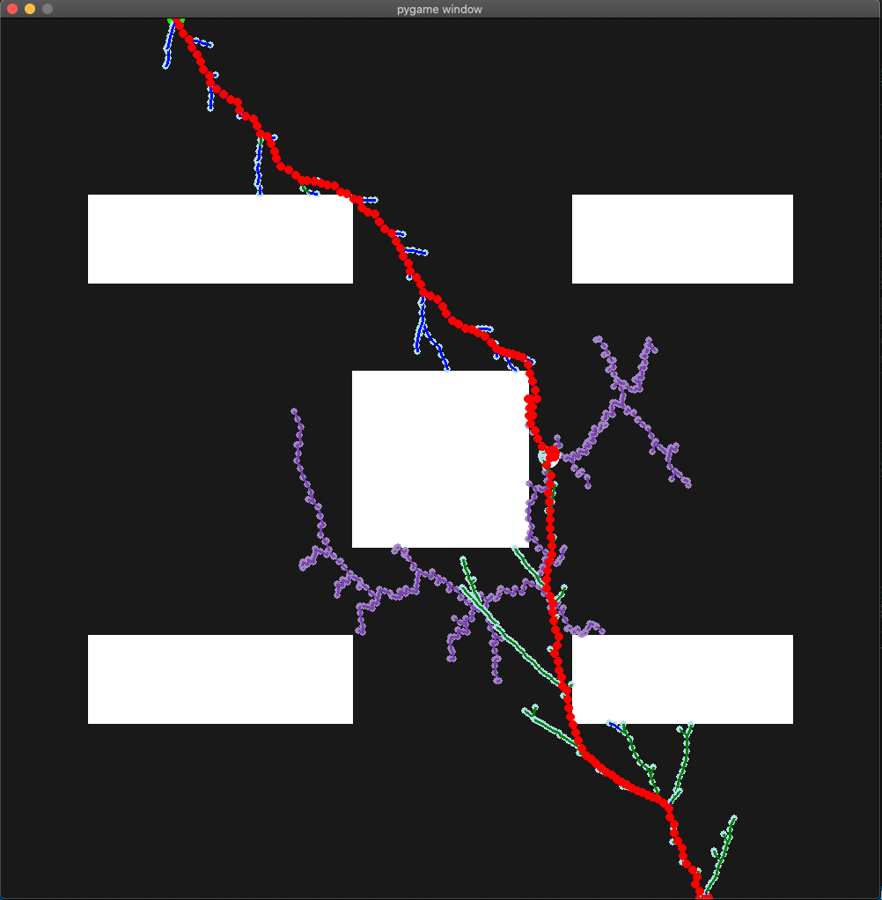
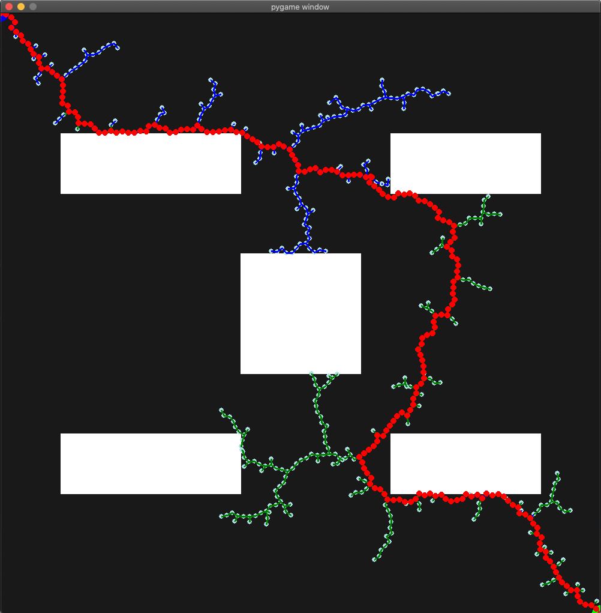
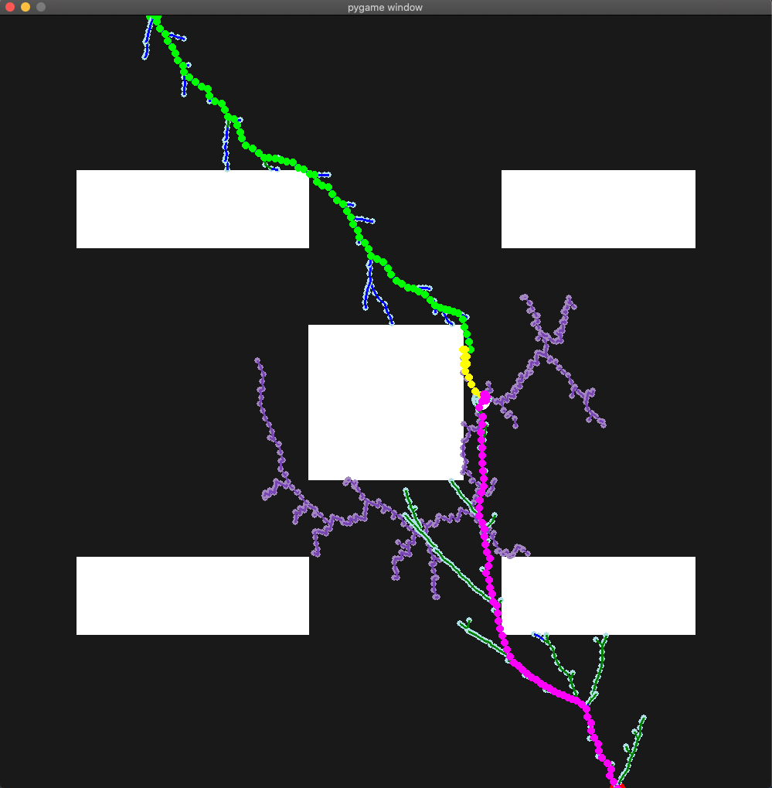
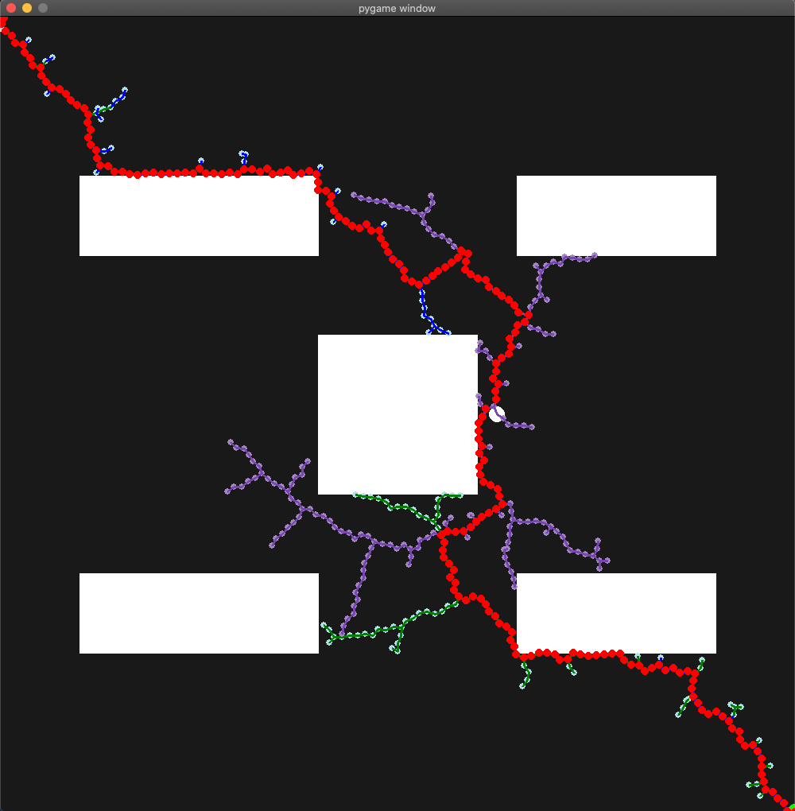

# RRT  Algorithm Variants

 The repository contains several variants of  rapidly exploring random tree (RRT) algorithm. As a sampling based search algorithm, it searches large non-convex spaces by expanding branches in a random manner. I use it to find a path between point A nad point B on multiple 2D maps.

The enhanced variants of RRT leverage techniques like bi-directional search and potential field to improve the efficiency and optimality of the classic RRT algorithm.
## Acknowledgements

 - [Intro to RRT](https://www.cs.cmu.edu/~motionplanning/lecture/lec20.pdf)
 - [Variant 1 - Imporved RRT Connect](https://ieeexplore.ieee.org/document/9419385)
 - [Variant 2 -GT-RRT](https://ieeexplore.ieee.org/document/9602848/keywords#keywords)

## Python Scripts

The repository contains a folder called PythonScript. It contains 8 python files, mentioned below. The script does not ask for user input. The start node and end node can be updated inside the Main function, at the bottom of each script.

#### *RRT and RRT Connect*
- RRT
- RRT-Connect Map 1 
- RRT-Connect Map 2

#### *Biased RRT Connect*
- RRT-Connect Biased

#### *Improved RRT Connect*
- Imporved RRT-Connect Map 1

#### *GT - RRT*
- GT-RRT Map 2
- RRT-Connect 3-Node Map 2
- GT-RRT Empty Map
## License

[MIT](https://choosealicense.com/licenses/mit/)

## Results

## Support

For support, email jaisharm@umd.com.

